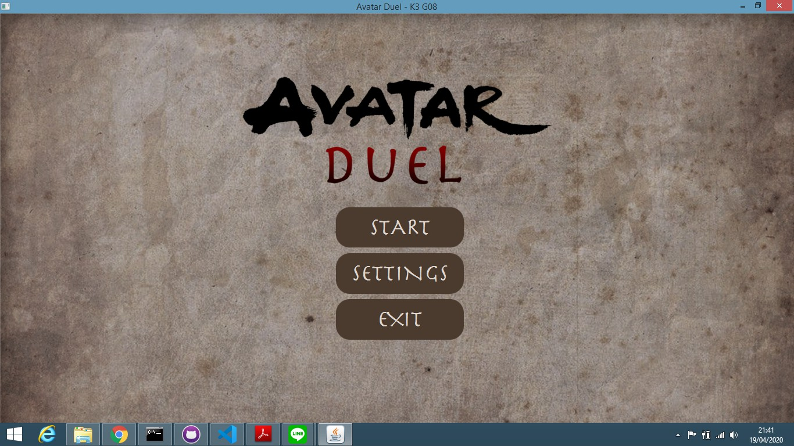

# Struktur kode
- `com/avatarduel/model` mencakup kode program kelas-kelas kartu, kelas card collection, kelas player, kelas-kelas event
- `com/avatarduel/util` mencakup kode CSV reader
- `com/avatarduel/view` mencakup kode tampilan aplikasi

# Cara compile sekaligus run
1. jalankan perintah cmd `gradlew run`

# Screenshot aplikasi

